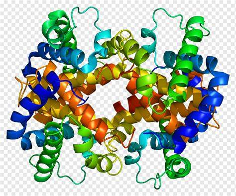

# Tracking the Evolution of the Hemoglobin Beta Gene Across Species 

## Introduction
The Hemoglobin Beta (HBB) gene plays a central role in oxygen transport in vertebrates and has long served as a model for studying molecular evolution. In this study, I investigated the conservation of the HBB gene across selected species to infer evolutionary relationships and levels of sequence divergence.

## File_System 
    BioinformHER
    ├── Module-2-Mini-Project
    │   ├── BioinformHer_Mini_Project_2.pdf
    │   └── README.md
    ├── README.md
    ├── assets
    │   ├── HBB_protein.jpeg
    │   └── file_systems.jpg
    ├── data
    │   ├── Humans_gene
    │   │   └── 1394355623.fasta
    │   ├── allgenes.fasta
    │   ├── metadata
    │   │   └── accession_IDs.txt
    │   ├── output
    │   │   ├── MSA.fasta
    │   │   ├── MSA.png
    │   │   ├── Phylo_Tree.mtsx
    │   │   ├── Skylign_Logo.png
    │   │   ├── Skylign_Logo.svg
    │   │   ├── conserved_ranges.txt
    │   │   ├── humvsgor.needle
    │   │   └── humvssciureus.needle
    │   ├── report
    │   │   ├── Tracking the Evolution of the Hemoglobin Beta Gene Across Species.docx
    │   │   └── Tracking the Evolution of the Hemoglobin Beta Gene Across Species.pdf
    │   └── sim_genes
    │       ├── AY279113.1_Aotus_azarai_beta_globin_gene_complete_cds.fasta
    │       ├── AY279114.1_Lagothrix_lagotricha_beta_globin_gene_complete_cds.fasta
    │       ├── AY279115.1_Cebus_apella_beta_globin_gene_complete_cds.fasta
    │       ├── AY279116.1_Saimiri_sciureus_beta_globin_gene_complete_cds.fasta
    │       └── X61109.1_G.gorilla_beta-globin_gene.fasta
    ├── environment.yml
    ├── logs
    │   └── retrieving_sequences.log
    └── src
        ├── MSAanalysis.py
        ├── __pycache__
        │   ├── retrieving_sequences.cpython-310.pyc
        │   └── retrieving_sequences.cpython-312.pyc
        ├── retrieving_sequences.py
        └── similar_sequences.py

| File/Folder    | Description                |
|--------------- |----------------------------|
| assets/        | Supporting visuals         |
| data/Human_gene/| Contains retrieved Human HBB gene sequence  |
| data/metadata/| Contains Accession_ID file of Human HBB Entrez result
| data/output/| Contains MSA, phylogenetic tree picture and MEGA12 session, conserved ranges of MSA, skylign logo results in png and vector form,  and pairwise alignment results|
| data/report/| Contains submission documents|
| data/sim_genes/| Contains fasta files of HBB sequences similar to Human HBB retrieved by NCBI BLAST| 
data/allgenes.fasta| Fasta file of all genes sequences under study. Input file for MSA|
| logs/          | Contains logs of run codes |
|  Module-2-Mini-Project| Instructions manual|
| src/_ pycache_ /| Compiled versions of python files|
| src/MSAanalysis.py| Analyzed MSA to retrieve conserved domains and regions|
| src/retrieving_sequences.py | Uses NCBI Entrez through Biopython to download Human HBB gene sequence|
| environment.yml| conda environment requirements for project|
| README.md      | Project overview and usage |

